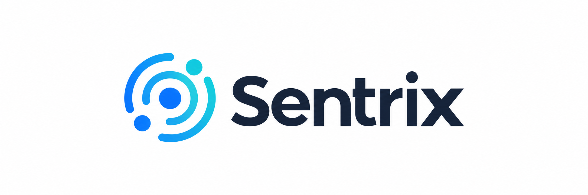

# Sentrix

**Sentrix** is a multi-tenant observability and monitoring platform for metrics, logs, traces, dashboards, alerts, and infrastructure visibility. This starter establishes the production-minded foundation using **Python 3.14, Django 6.1.x, React 19.3, PostgreSQL, Redis, and ClickHouse**.

The repository intentionally starts with the **control plane**. It establishes authentication, organizations, projects, tenant scoping, RBAC boundaries, health checks, local infrastructure, testing conventions, and a React application shell before metrics, logs, and traces are introduced.



**Recommended repository name:** `sentrix`

## Product identity

- Product: **Sentrix**
- Category: observability and monitoring platform
- Primary brand asset: `assets/sentrix-logo.png`
- Frontend-served asset: `frontend/public/brand/sentrix-logo.png`
- Public API prefix: `/api/v1/`
- Docker Compose project: `sentrix`

The brand name must remain separate from domain boundaries. Metrics, logs, traces, organizations, projects, and alerts should use domain terminology in code instead of brand-prefixed model names.

## Why this architecture

Sentrix has two very different workloads:

- **Control plane:** users, organizations, projects, permissions, dashboards, alert definitions, integrations, audit records, billing metadata.
- **Telemetry data plane:** metrics, logs, traces, events, ingestion, aggregation, retention, and high-volume analytical queries.

Django and PostgreSQL own the control plane. ClickHouse owns telemetry storage. Redis is used for caching, coordination, rate-limit state, and future background processing. Telemetry must not be modeled as ordinary Django/PostgreSQL rows.

```text
React + TypeScript
       |
       | HTTPS / JSON
       v
Django control plane -------------------- PostgreSQL
       |                                     users
       |                                     organizations
       |                                     projects
       |                                     memberships
       |
       +---------------------------------- Redis
       |                                     cache / coordination
       |
       +---- query boundary ------------ ClickHouse
                                             metrics / logs / traces

Future telemetry path:
SDKs / Agents -> OpenTelemetry Collector -> Ingestion Gateway -> Stream -> Workers -> ClickHouse
```

## Repository layout

```text
.
├── backend/                  Django control plane
│   ├── apps/
│   │   ├── accounts/         Session authentication API
│   │   ├── common/           Health/readiness and shared primitives
│   │   ├── organizations/    Organizations, membership and RBAC
│   │   └── projects/         Tenant-scoped projects
│   └── config/               Django settings and routing
├── frontend/                 React + TypeScript application
│   └── public/brand/         Sentrix product assets
├── scripts/                  Developer convenience scripts
├── assets/                   Repository-level Sentrix brand assets
├── ARCHITECTURE.md
├── CODING_GUIDELINE.md
├── V1_MILESTONE.md
├── V1_MILESTONE_TESTING.md
├── docker-compose.yml
└── .env.example
```

## Prerequisites

Recommended host tooling:

- Python **3.14**
- [uv](https://docs.astral.sh/uv/)
- Node.js **24 LTS or newer**
- npm **11 or newer**
- Docker Desktop with Docker Compose v2
- Git

On Windows 11, PowerShell 7 is recommended.

## Fastest start: Docker Compose

```powershell
Copy-Item .env.example .env
docker compose up --build
```

After services become healthy:

- Frontend: `http://localhost:5173`
- API: `http://localhost:8000/api/v1/`
- Liveness: `http://localhost:8000/api/v1/health/live/`
- Readiness: `http://localhost:8000/api/v1/health/ready/`
- ClickHouse HTTP: `http://localhost:8123`

Create a Django superuser:

```powershell
docker compose exec api uv run python manage.py createsuperuser
```

## Local development without containerizing the app processes

Keep PostgreSQL, Redis, and ClickHouse in Docker:

```powershell
docker compose up -d postgres redis clickhouse
```

Backend:

```powershell
cd backend
uv sync --group dev
uv run python manage.py migrate
uv run python manage.py runserver 0.0.0.0:8000
```

Frontend in another terminal:

```powershell
cd frontend
npm install
npm run dev
```

The frontend dev server proxies `/api` to Django by default.

## First API flow

1. Open the frontend and create or use a Django user.
2. Sign in through the React login form.
3. Create an organization.
4. Create a project inside that organization.
5. Verify that another user without membership cannot list or access that project.

Example API surface included by this starter:

```text
GET    /api/v1/health/live/
GET    /api/v1/health/ready/
GET    /api/v1/auth/csrf/
POST   /api/v1/auth/login/
POST   /api/v1/auth/logout/
GET    /api/v1/auth/me/
GET    /api/v1/organizations/
POST   /api/v1/organizations/
GET    /api/v1/organizations/{id}/
PATCH  /api/v1/organizations/{id}/
GET    /api/v1/projects/
POST   /api/v1/projects/
GET    /api/v1/projects/{id}/
PATCH  /api/v1/projects/{id}/
```

## Dependency locking

The Sentrix starter does not invent lockfiles without resolving the package indexes. On the first development setup, run `uv sync --group dev` in `backend` and `npm install` in `frontend`, then commit the generated `backend/uv.lock` and `frontend/package-lock.json`. From that point onward, CI and release builds should use the committed locks.

## Quality commands

The development API image installs the `dev` dependency group so tests, Ruff, and mypy are available inside the container. Production images should use a separate build target that excludes development tooling.

Backend from the host:

```powershell
cd backend
uv run ruff check .
uv run ruff format --check .
uv run mypy .
uv run pytest
```

Backend from Docker Compose:

```powershell
docker compose exec api /opt/venv/bin/python -m pytest
docker compose exec api /opt/venv/bin/ruff check .
docker compose exec api /opt/venv/bin/mypy .

Generated Django migrations are excluded from Ruff; use `makemigrations --check --dry-run` plus the backend test suite to verify migration consistency.
```

Frontend:

```powershell
cd frontend
npm run lint
npm run typecheck
npm run test
npm run build
```

Repository smoke checks:

```powershell
./scripts/verify.ps1
```

## Environment configuration

Copy `.env.example` to `.env` and change secrets before any shared or deployed environment.

Important settings:

| Variable | Purpose |
| --- | --- |
| `DJANGO_SECRET_KEY` | Django cryptographic signing key |
| `DJANGO_DEBUG` | Development-only debug mode |
| `DJANGO_ALLOWED_HOSTS` | Allowed Host header values |
| `POSTGRES_*` | Control-plane database |
| `REDIS_URL` | Cache/coordination connection |
| `CLICKHOUSE_*` | Telemetry database connection |
| `CORS_ALLOWED_ORIGINS` | Explicit browser origins allowed to call the API |
| `CSRF_TRUSTED_ORIGINS` | Origins trusted for state-changing session requests |

Never commit `.env`.

## Engineering rules

The complete rules are in [CODING_GUIDELINE.md](CODING_GUIDELINE.md). The non-negotiable items are:

1. Every tenant-owned query is scoped from the authenticated user's memberships. Never trust `organization_id` from the browser by itself.
2. PostgreSQL stores control-plane state, not raw telemetry.
3. API behavior is covered by tests before a milestone is accepted.
4. Schema changes include migrations in the same commit.
5. Security checks live on the backend. Hiding a button in React is not authorization.
6. No feature is complete until README/docs and tests are updated.

## Milestone documents

- [V1_MILESTONE.md](V1_MILESTONE.md) defines the V1 implementation scope and acceptance criteria.
- [V1_MILESTONE_TESTING.md](V1_MILESTONE_TESTING.md) defines the test matrix and release gate.
- [ARCHITECTURE.md](ARCHITECTURE.md) defines system boundaries and the path from the V1 control plane to telemetry ingestion.

## V1 definition of done

V1 is complete when a user can authenticate, create an organization, create a project, and access only resources permitted by their membership and role; the React application can operate against those APIs; PostgreSQL, Redis, and ClickHouse health are observable; and all documented backend/frontend quality gates pass.

Metrics, logs, traces, OpenTelemetry ingestion, dashboards, alert evaluation, and incident workflows are deliberately reserved for later milestones after the control-plane boundaries are proven.

## Project workspace flow

The control-plane UI now has a canonical tenant-aware project workspace route:

```text
/orgs/:organizationSlug/projects/:projectSlug
/orgs/:organizationSlug/projects/:projectSlug/:section
```

Supported workspace sections are `overview`, `metrics`, `logs`, `traces`, `dashboards`, and
`alerts`. Only the overview contains control-plane project context in V1; the remaining routes are
intentional placeholders for later data-plane milestones and do not fabricate telemetry.

Workspace behavior:

- organization and project switchers navigate only through resources returned by the authenticated,
  tenant-scoped APIs;
- owner/admin/editor memberships get project-write UI while viewer memberships are shown as
  read-only;
- typing a foreign or unknown slug does not grant access and resolves to an unavailable workspace;
- backend UUID detail/update/delete endpoints remain the authorization boundary and continue to use
  membership-scoped querysets;
- project cards on the overview page open the canonical project workspace route.

Frontend routing is a navigation concern only. URL organization/project slugs must never be treated
as authorization evidence.

## Sentrix visual system

The web application uses **Tailwind CSS 4** through the official Vite plugin. Sentrix keeps the
framework configuration CSS-first: `frontend/src/styles.css` imports Tailwind and the dedicated `frontend/src/theme.css` token file;
`theme.css` defines product design tokens with `@theme`, while the global stylesheet composes the
current semantic component classes with Tailwind utilities.

The default product theme is **Sentrix Spectrum**, a compact observability-focused dark interface:

- deep navy canvas and elevated blue-black surfaces with softened off-white text instead of pure white;
- restrained signal teal for primary actions and active navigation, avoiding neon treatment;
- electric violet as a secondary data/feature accent;
- dedicated amber, green, and red states for read-only/warning, success, and errors;
- readable muted, helper, placeholder, and disabled text without low-opacity labels disappearing into the canvas;
- comfortable contrast that preserves legibility while avoiding glare from pure-white text or over-saturated controls;
- tighter 52px application chrome, compact controls, reduced panel padding, and denser lists;
- consistent radii, borders, focus rings, buttons, inputs, selects, badges, and empty states.

After pulling a change that modifies frontend packages, refresh the existing Compose node_modules
volume before running frontend gates:

```powershell
docker compose exec web npm install
docker compose restart web
```

The visual system must not encode authorization. Disabled/hidden project controls improve UX, while
Django remains the security boundary.
